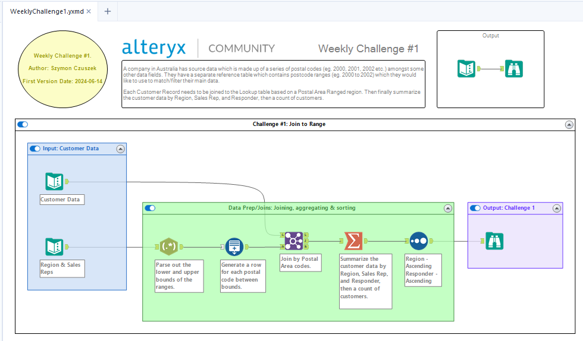
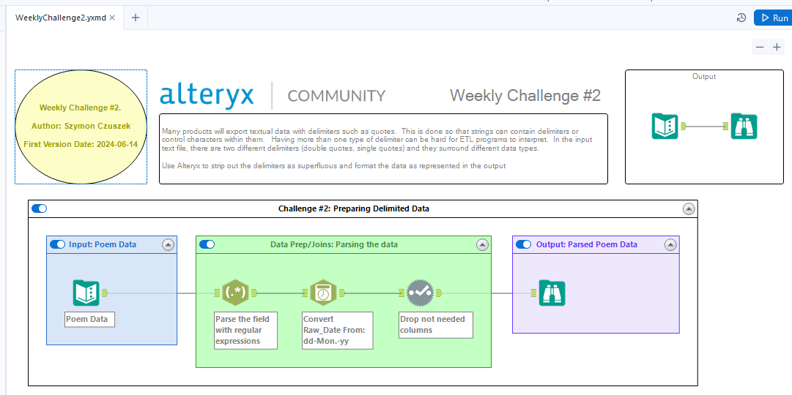
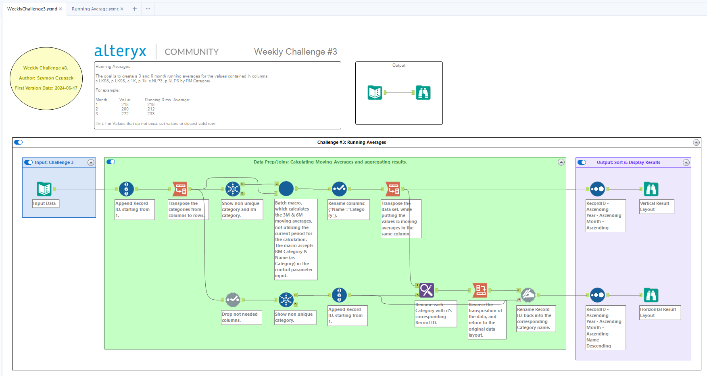
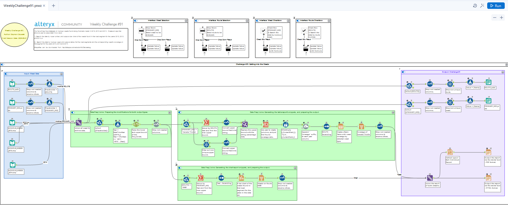

# Alteryx Weekly Challenges

Welcome to the Alteryx Weekly Challenges repository! This repository contains solutions to various weekly challenges provided by Alteryx. Each challenge is designed to enhance your data analysis and problem-solving skills using Alteryx Designer.

## Important Notice

The challenges themselves, along with the starting files provided for each challenge, are the property of Alteryx Inc. These materials are not subject to the MIT license that governs the rest of the content in this repository. The MIT license applies only to the solutions and other original content created by the repository owner.

This repository is not affiliated with or endorsed by Alteryx Inc. in any way.

## Snippet List

Here is a list of the weekly challenges included in this repository along with their respective solution files:
- [WeeklyChallenge1.yxmd](WeeklyChallenge1.yxmd): Challenge #1: Join to Range
   
- [WeeklyChallenge2.yxmd](WeeklyChallenge2.yxmd): Challenge #2: Preparing Delimited Data
   
- [WeeklyChallenge3.yxzp](WeeklyChallenge3.yxzp): Challenge #3: Running Averages
   
- [WeeklyChallenge3.yxzp](WeeklyChallenge3.yxzp): Challenge #3: Running Averages Macro
- [WeeklyChallenge91.yxwz](WeeklyChallenge91.yxwz): Challenge #91: Getting into the Weeds
   
- [WeeklyChallenge115.yxwz](WeeklyChallenge115.yxwz): Challenge #115: Let's get crafty!
   
- [WeeklyChallenge132.yxmd](WeeklyChallenge132.yxmd): Challenge #132: When Will Community Hit 1,000,000 Posts?
   
- [WeeklyChallenge158.yxwz](WeeklyChallenge158.yxwz): Challenge #158: Personality Quiz
   
- [WeeklyChallenge170.yxmd](WeeklyChallenge170): Challenge #170: 2019 Grand Prix US - Heat 1
   
- [WeeklyChallenge175.yxzp](WeeklyChallenge175.yxzp): Challenge #175: Tire Size Calculator
   
- [WeeklyChallenge213.yxmd](WeeklyChallenge213.yxmd): Challenge #213: Optimized Flower Arrangements
   
- [WeeklyChallenge215.yxzp](WeeklyChallenge215.yxzp): Challenge #215: Gotta Catch 'em All!
   
- [WeeklyChallenge230.yxzp](WeeklyChallenge230.yxzp): Challenge #230: Take a Look, It's in a Book!
   
- [WeeklyChallenge233.yxzp](WeeklyChallenge233.yxzp): Challenge #233: The Truth Is Out There
   
- [WeeklyChallenge238.yxzp](WeeklyChallenge238.yxzp): Challenge #238: Ideal Gases Don't Exist
   
- [WeeklyChallenge244.yxzp](WeeklyChallenge244.yxzp): Challenge #244: Cats and Dogs
   

## Workflow Screens

To view the workflows as is in the Alteryx Designer, go to the [Screen-Page.md](Workflow-Screens/Screen-Page.md).

## License
The solutions and any other original content in this repository are licensed under the MIT License. However, please note that the challenges themselves and the starting files provided for each challenge are proprietary to Alteryx Inc. and are not covered under this license. For more details about the MIT license, please refer to the [LICENSE](LICENSE) file.

## Closing Remarks

Feel free to explore the solutions and enhance your Alteryx skills. Contributions and discussions are welcome!
